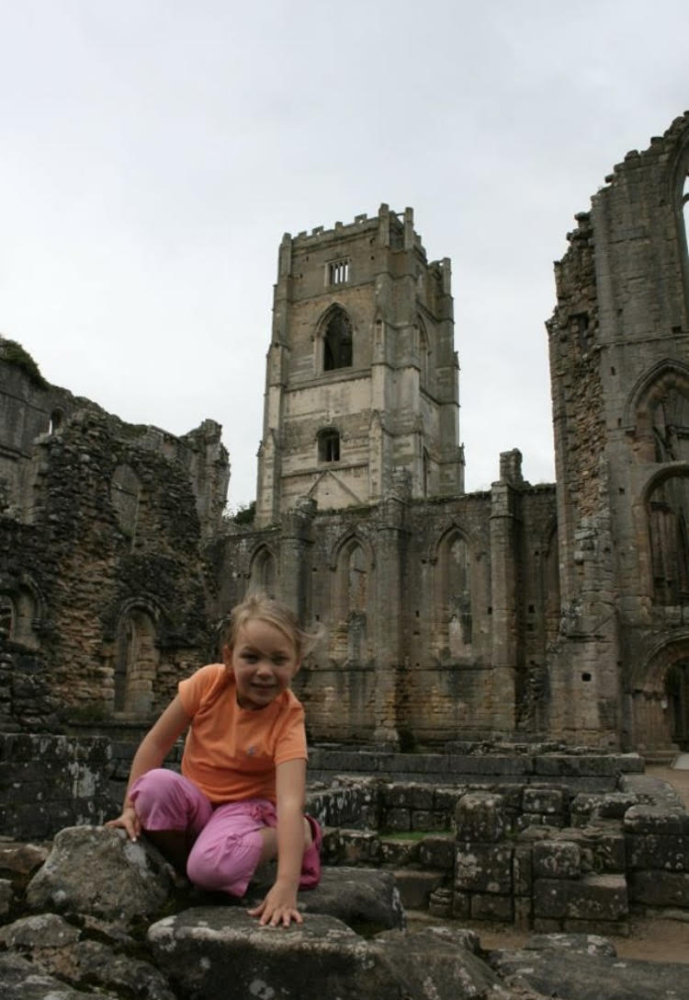
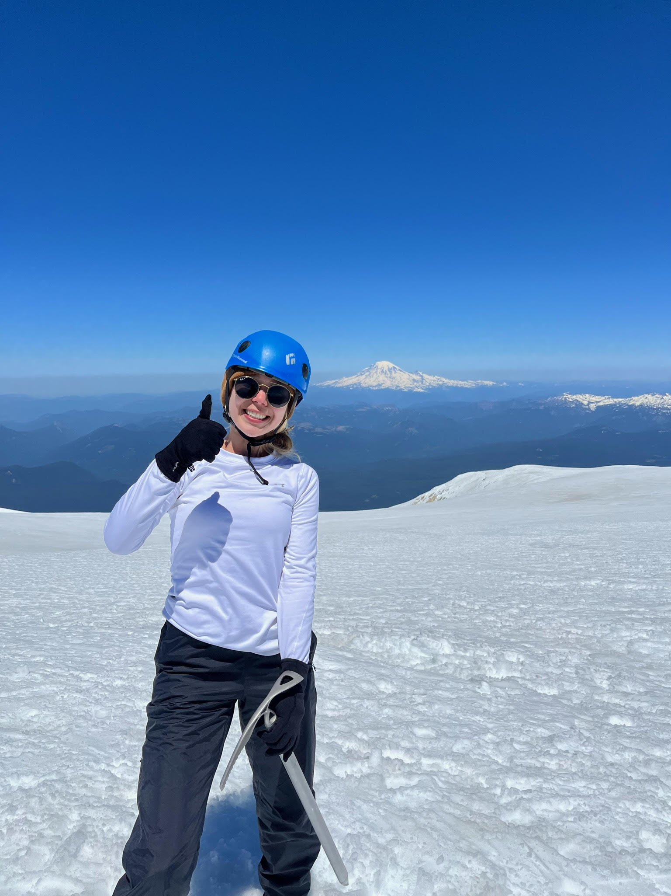
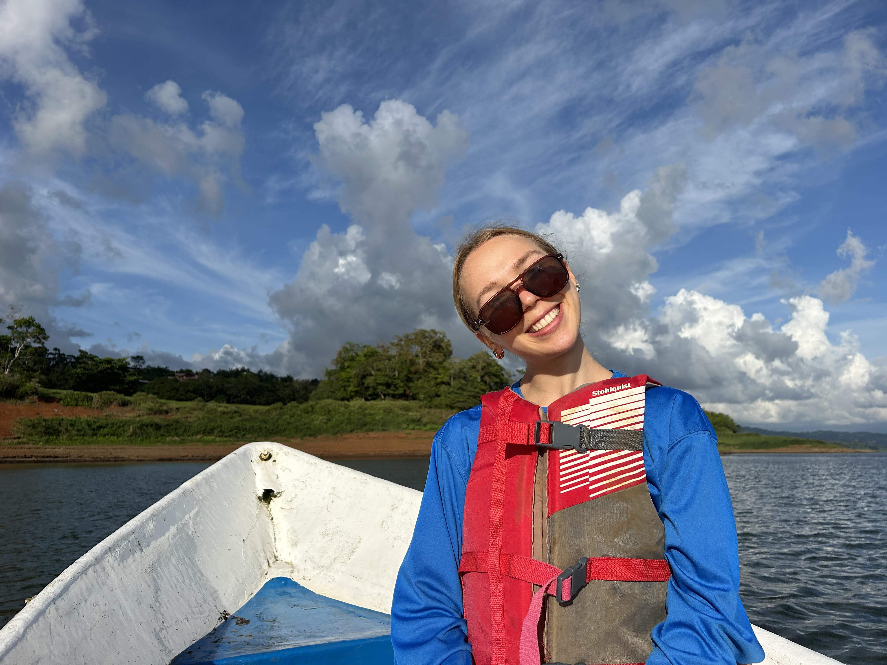
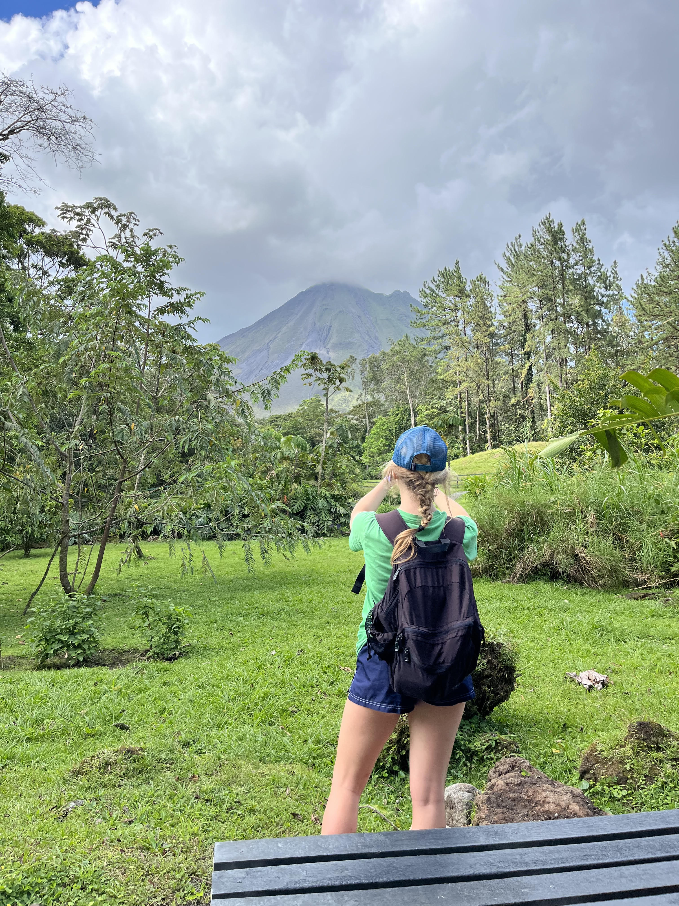
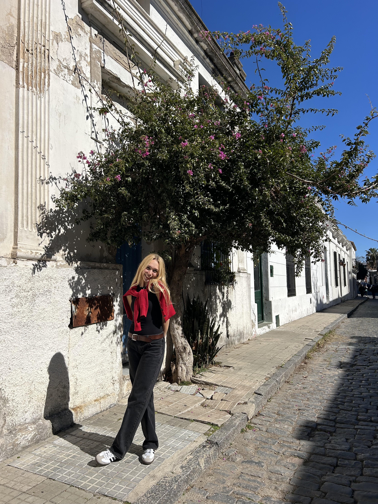

**Hi! My name's Grace and this is my travel blog.**

Ever since I can remember, I've always had a fervent love for travel. Whether it was my upbringing in a family that was constantly seeking out new destinations, or a passion I picked up on my own, I have always found traveling to be the most envigorating experience. So when I stumbled upon a word that seemed tailor-made to describe my, let's say, *enthusiastic* relationship with exploring the world, I knew I had found my first blog topic -- or at least my diagnosis.

**What is dromomania?**

The American Psychological Association Dictionary defines dromomania as: 
*"an abnormal drive or desire to travel that involves spending beyond one’s means and sacrificing job, partner, or security in the lust for new experiences. People with dromomania not only feel more alive when traveling but also start planning their next trip as soon as they arrive home. Fantasies about travel occupy many of their waking thoughts and some of their dreams. The condition was formerly referred to as vagabond neurosis."*

**Where it all started...**

{fig-align="left" width=70%}

When I was 6 years old, my parents uprooted our calm, quaint life in Western Pennsylvania, and moved our family to the Netherlands. After settling down, we took our first family trip to England, where I tried my first sausage roll and began showing early symptoms of dromomania. I vividly remember my favorite part of our stay: a day trip to Fountains Abbey -- a slightly dilapidated, but remarkably beautiful monastery from the 12th century. As I reflect on my childhood travels now, I am able to appreciate how immensely privileged I was to have picturesque, educative European sites as my playground.

Since this first big trip, I've become obsessed with traveling in all of its surprsing detours, awe-inspiring locations, and collectable passport stamps. Whenever I'm on a trip, I feel most like myself, as the creative, spontaneous sides of me burst from their confines and look for every chance to maximize the experience of being in entirely uncharted territory. The moment I touch down in my familiar home airport (and reality), my mind immediately begins plotting my next trip, as if I hadn't just been somewhere new. While this might sound like ingratitude, I can assure you that I am unexplicably grateful for every travel experience I've been lucky to have. To express this gratitude, I've put together a few of my favorite trips and hope to use this blog as a tribute to the people they've introduced me to, the lessons they've taught me, and the pretty cool pictures they've given me. 

**Where it's taken me...**

{fig-align="left" width=70%}

One of my most memorable trips was to Washington State, where my Dad and I embarked on a 3-day climb up Mt. Adams. We were with an organization that has impressively actuated its incredible founding mission: raising money for breast cancer and multiple sclerosis research. After three brutal days of freeze-dried meals, sunburn, and intense wind chill, we finally summitted the mountain. The next day, I came down with sore legs, 10 new lifelong friends, and an overwhelming appreciation for my good health, which allowed me to have this transformative experience.

{fig-align="left" width=70%}

Unlike the previous, my next trip took me southbound, to Lake Atitlan, Guatemala. The lakes I was used to, as a girl from rural Pittsburgh suburbs, certainly did not prepare me for the remarkable natural wonder that is Lake Atitlan. I was lucky to meet someone who owned a boat-tour business and got to see the three hulking volcanoes -- Atitlan, Toliman, and San Pedro -- as well as the surrounding lake towns, from the water viewpoint. This outing will forever be one of my favorites and one that my mind wanders to whenever my travel itch starts to flare up.   

{fig-align="left" width=70%}

My run-in with the breathtaking volcanoes of Guatemala clearly wasn't enough to satiate my craving for explosive natural wonders, as I soon planned a trip to Nuevo Arenal, Costa Rica. Here, I was able to hike around the base of Volcan Arenal, taking in the beautiful scenes around me and the (slightly) rattling screams of howler monkeys. While the topography was enough to leave a major impression on me, what really stuck was the appreciative, relaxed outlook of the Costa Rican people. Every individual I had the pleasure of interacting with had a genuine heart for others and a desire to welcome people from all walks of life. I hope to learn and embody this wherever I go -- both on my travels and at my home base.     

{fig-align="left" width=70%}

Last, but certainly not least, was my trip to Colonia del Sacramento in Uruguay. The moment I entered the coastal town, I knew my 5 AM wakeup for the 6 AM ferry from Argentina had been worth it. I was stunned at how quickly I was able to travel from the Europe-esque metropolis of Buenos Aires to the quiet oasis of Colonia del Sacramento. The village was brimming with history, Portuguese-influence, and kind people, making it a trip I certainly will never forget. 

If there's one thing these four trips have taught me, it's that the world is much more generous than we give it credit for. From the ruins of Fountains Abbey to the sunny shores of Colonia del Sacramento, each place has given me something unique, whether that be a lesson, a friendship, a perspective, or a momentary breath of fresh air from the chaotic world we live in. On the basis of this understanding I've reached a conclusion. Although dromomania may technically be a diagnosis, I can't say I'm in a big rush to find a cure because without it, I likely wouldn't have gotten to experience any of these places. I can assure you I'll stay "sick" with dromomania and you, stay tuned! 